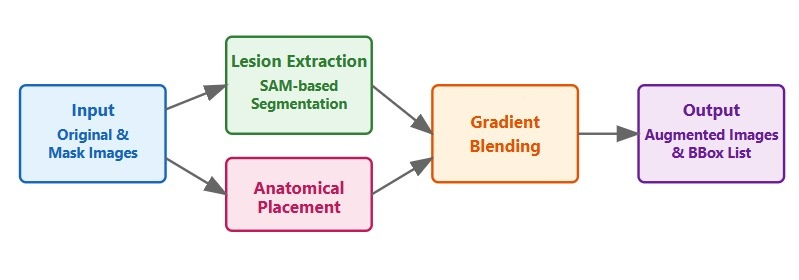
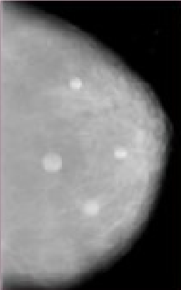

# MEDSAMAugmentor

[](https://opensource.org/licenses/MIT)
[](https://www.python.org/downloads/release/python-380/)
[](https://github.com/psf/black)
[](https://arxiv.org/abs/2024.XXXXX)

A Python Framework for Intelligent Mammographic Data Augmentation using Segment Anything Model (SAM)

<p align="center">
  
</p>

## Overview

MEDSAMAugmentor is a comprehensive framework that implements intelligent data augmentation techniques for mammographic images through a novel integration with Segment Anything Model (SAM). The framework provides researchers and practitioners with a sophisticated pipeline comprising:

- **Lesion Extraction**: Automated extraction using SAM's zero-shot segmentation
- **Anatomical Placement**: Intelligent positioning considering tissue patterns
- **Gradient Blending**: Seamless integration with progressive alpha blending

## Key Features

- 🔍 **Intelligent Segmentation**: Leverages SAM for precise lesion extraction
- 🎯 **Anatomically-Informed**: Ensures realistic lesion positioning
- 🔄 **Progressive Blending**: Creates natural tissue transitions
- 📊 **Bounding Box Generation**: Automatic annotation for downstream tasks
- 🛠️ **Easy Integration**: Simple API for existing deep learning workflows
- 📏 **Quality Control**: Maintains clinical validity of augmented images

## Installation

```bash
# Clone the repository
git clone https://github.com/diclebilgisayar/medsam-augmentor.gits
cd medsam-augmentor

# Install dependencies
pip install -r requirements.txt

# Install the package
python setup.py install
```

## Quick Start

```python
from medsam_augmentor import MEDSAMAugmentor

# Initialize augmentor
augmentor = MEDSAMAugmentor(config_path='config/config.yaml')

# Load images
original_image = augmentor.load_mammogram(image_path)
mask_image = augmentor.load_mammogram(mask_path)

# Perform augmentation
augmented_images, bboxes, original_bbox = augmentor.augment(
    image=original_image,
    mask=mask_image,
    num_augmentations=3,
    preserve_labels=True
)

# Save results
augmentor.save_results(
    augmented_images=augmented_images,
    bboxes=bboxes,
    output_dir=output_dir,
    original_bbox=original_bbox
)
```

## Documentation

For detailed documentation, please visit our [Documentation Page](docs/README.md).

### Example Usage

<p align="center">
  
</p>

The above figure demonstrates various augmentation results, showcasing the framework's capability to:
- Maintain anatomical validity
- Create realistic tissue transitions
- Preserve clinical features
- Generate accurate bounding boxes

## Project Structure

```
medsam-augmentor/
├── medsam_augmentor/       # Main package directory
│   ├── lesion_extractor.py # SAM-based lesion extraction
│   ├── anatomical_placer.py# Anatomical positioning logic
│   ├── gradient_blender.py # Progressive blending implementation
│   └── utils.py           # Utility functions
├── config/                 # Configuration files
│   └── config.yaml        # Default configuration
├── examples/              # Usage examples
└── tests/                 # Test cases
```

## Contributing

We welcome contributions! Please see our [Contributing Guidelines](CONTRIBUTING.md) for details.

## Citation

If you use MEDSAMAugmentor in your research, please cite our paper:

```bibtex
@article{medsam2024,
  title={MEDSAMAugmentor: A Python Framework for Intelligent Mammographic Data Augmentation using Segment Anything Model},
  author={Ataş, İsa},
  journal={Software Impacts},
  year={2024}
}
```

## License

This project is licensed under the MIT License - see the [LICENSE](LICENSE) file for details.

## Acknowledgments

- Thanks to Meta AI Research for the Segment Anything Model
- CBIS-DDSM dataset creators and maintainers
- All contributors and supporters

## Contact

For questions and feedback:
- 📧 Email: [isaatas21@gmail.com](mailto:isaatas21@gmail.com)
- 🌟 Issues: [GitHub Issues](https://github.com/diclebilgisayar/medsam-augmentor/issues)

---
<p align="center">
  Made with ❤️ for the Medical Imaging Community
</p>
